# Threatpedia — System Architecture

High-level view of the two-repo split, content collections, pipeline
lane, and deploy path. Companion diagrams:

- [`pipeline-flow.md`](./pipeline-flow.md) — task lifecycle end-to-end
- [`discovery-rejection.md`](./discovery-rejection.md) — discovery + rejection-memory lane
- [`dispatcher-guardrails.md`](./dispatcher-guardrails.md) — operator-controls view

```mermaid
%%{init: {'theme':'base','themeVariables':{
  'background':'#080b10',
  'primaryColor':'#0d1117','primaryTextColor':'#cdd5e0','primaryBorderColor':'#1e2733',
  'lineColor':'#e8a020','secondaryColor':'#0d1117','tertiaryColor':'#0d1117',
  'fontFamily':'IBM Plex Mono, ui-monospace, monospace'
}}}%%
flowchart LR
  subgraph ACTORS["operators"]
    direction TB
    KK["Kernel K<br/>merge authority"]
    DM["DangerMouse-Bot<br/>implementation"]
    EP["Penfold-Bot<br/>review / editorial"]
  end

  subgraph PRIV["threatpedia-working (private)"]
    direction TB
    SPECS["specs/<br/>ADRs · workflows"]
    INBOX["inbox/<br/>task files"]
    SUPER["supervisor/<br/>handoff queue"]
    EDIT["editorial-pass/<br/>pre-publish review"]
  end

  subgraph PUB["threatpedia (public)"]
    direction TB

    subgraph CONTENT["site/src/content/"]
      INC["incidents/"]
      CAMP["campaigns/"]
      ZD["zero-days/"]
      TA["threat-actors/"]
    end

    subgraph SCHEMA["schema authority"]
      CC["content.config.ts<br/>(Zod)"]
      SCH["pipeline-schema.mjs<br/>(JS mirror)"]
    end

    subgraph PIPELINE[".github/pipeline/ + scripts/"]
      CFG["config.yml<br/>pipeline-config.mjs (js-yaml)"]
      TASKS["tasks/TASK-YYYY-NNNN.json<br/>canonical shape"]
      REJ["rejected-candidates.json<br/>operator veto memory"]
    end

    BUILD["Astro build<br/>GitHub Pages"]
  end

  KK ==> PRIV
  DM ==> PRIV
  EP ==> PRIV

  PRIV -. "PR via<br/>merge authority" .-> PUB

  CC --> CONTENT
  CC --> SCH
  CFG --> TASKS
  REJ --> TASKS
  TASKS --> CONTENT
  CONTENT --> BUILD
  BUILD -. "threatpedia.wiki" .-> END((( )))

  classDef accent fill:#0d1117,stroke:#e8a020,color:#f0b030;
  classDef dim fill:#0d1117,stroke:#1e2733,color:#5a6a7e;
  class KK,DM,EP accent;
  class END dim;
```

## Reading this diagram

- **Two repos, asymmetric trust.** `threatpedia-working` is the private
  operational substrate — specs, task queue, editorial pass, ADRs.
  `threatpedia` is the public corpus and site. Nothing merges from
  private to public without Kernel K review.

- **Schema authority flows one way.** `site/src/content.config.ts` (Zod)
  is the ultimate source of truth for article shape.
  `scripts/pipeline-schema.mjs` is the JS-side mirror consumed by the
  pipeline runner and validator workflow (shared module established
  in Slice 4b).

- **Pipeline is pure state.** The pipeline lane (`.github/pipeline/` +
  `scripts/`) is config + task files + rejection memory — no database,
  no backing service. Every knob is git-tracked.

- **Deploy is static.** Astro builds the site from the content
  collections on merge to `main`. GitHub Pages serves
  `threatpedia.wiki` directly.
