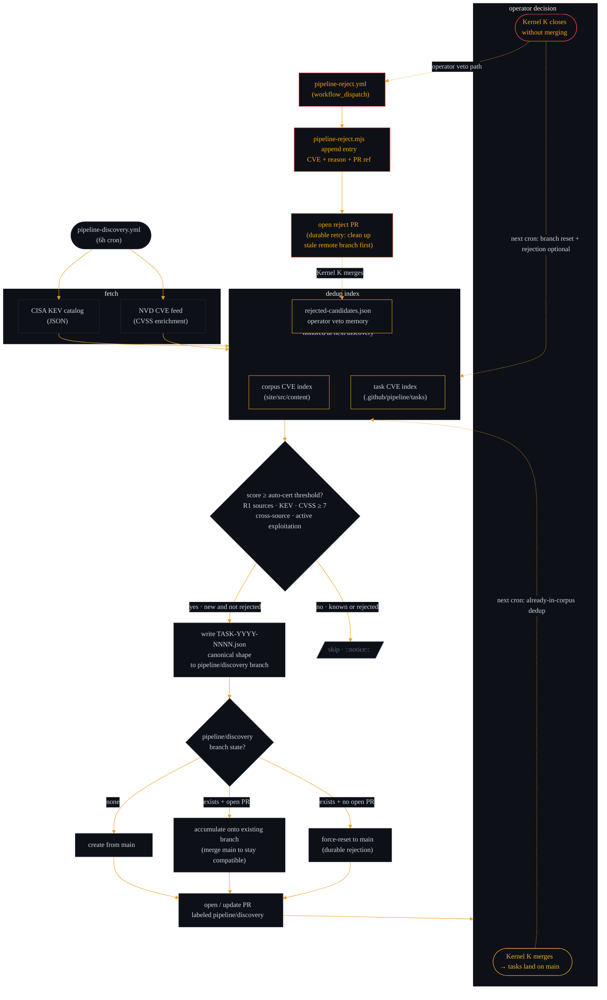

# Discovery + Rejection Memory Lane

How candidates move from the CISA KEV feed to a `pipeline/discovery`
PR — and how operator veto stays durable across runs. Covers Slices
2 / 4c hardening.

Companion diagrams:

- [`architecture.md`](./architecture.md) — system-level overview
- [`pipeline-flow.md`](./pipeline-flow.md) — full task lifecycle
- [`dispatcher-guardrails.md`](./dispatcher-guardrails.md) — dispatcher state machine

## Reading this diagram

- **Three dedup sources, one filter.** Discovery dedups against the
  live corpus, pending tasks, AND the rejection-memory file. The
  rejection set was added in Slice 4c — CVEs operator-vetoed there
  get skipped at the filter stage with a `::notice::` for audit
  visibility. Missing / malformed rejection file → warning +
  empty set (never hard-fails).

- **Long-lived branch with three states.** `pipeline/discovery` is
  the accumulation lane (Issue #61). If no prior branch exists,
  create from `main`. If there's an open PR, accumulate onto it. If
  the branch exists but has no open PR (prior batch merged or
  closed-without-merge), force-reset to `main` — this makes
  rejection durable even without explicit rejection-memory entries.

- **Rejection is PR-gated.** The only way into `rejected-candidates.json`
  is the `pipeline-reject.yml` workflow → `pipeline-reject.mjs` helper
  → PR against `main`. No direct push. Stale-branch handling was
  hardened in the Slice 4c follow-up patch so retrying for the same
  CVE never wedges on a non-fast-forward push.

- **Re-eligibility is manual.** To restore discovery eligibility for
  a rejected CVE, remove the entry from `rejected-candidates.json`
  via a PR edit. No automatic timeout — operator veto stays sticky.
