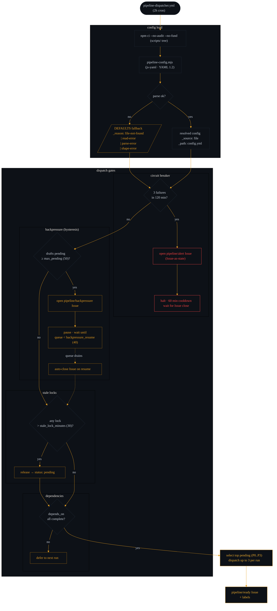

# Dispatcher Guardrails

The dispatcher's per-run decision flow: config load, then four gates
before any task is dispatched. Slices 4a (config authority) and 4e
(js-yaml swap) live here.

Companion diagrams:

- [`architecture.md`](./architecture.md) — system-level overview
- [`pipeline-flow.md`](./pipeline-flow.md) — full task lifecycle
- [`discovery-rejection.md`](./discovery-rejection.md) — discovery + rejection lane

## Reading this diagram

- **Config load never fails closed.** Four safe-default reasons
  cover every failure mode (file missing, I/O error, malformed YAML,
  non-map root). The dispatcher degrades to `DEFAULTS` and logs
  `_reason` — it never halts on a config issue. `_source` / `_path`
  surface in the step log so operators can see whether the run was
  on file-backed config or defaults.

- **Gates are serial, single-purpose, and Issue-backed.** Circuit
  breaker and backpressure both use the Issue-as-state pattern —
  no separate persistence, no new branches, no hidden JSON. Open
  Issues are the visible state; closing them resumes.
  **Distinction:** circuit breaker requires operator acknowledgement
  (Issue close). Backpressure auto-closes on the first run where the
  queue falls below `backpressure_resume`.

- **Stale-lock sweep runs every dispatch.** A task locked longer
  than `stale_lock_minutes` gets auto-released to `status: pending`
  so a stuck agent can't block the queue indefinitely. 30-minute
  default is tuned for the typical agent run time.

- **Dependency ordering is per-task.** `depends_on` lists block
  dispatch until the parent task's status reads `complete`.
  Unblocked work still flows around a blocked task — the
  dispatcher doesn't serialize the whole queue on one dependency.

- **Per-run ceiling is intentional.** Up to 3 tasks dispatched per
  run, hardcoded. Tunable to a config knob in a later slice if the
  pattern changes; today it's a deliberate cap, not a knob.
