# Pipeline Flow — Task Lifecycle End-to-End

The path a single task takes from discovery (or manual submission) to
merged article on `main`. Updated through Slice 4e.

Companion diagrams:

- [`architecture.md`](./architecture.md) — system-level overview
- [`discovery-rejection.md`](./discovery-rejection.md) — discovery + rejection-memory lane
- [`dispatcher-guardrails.md`](./dispatcher-guardrails.md) — operator-controls view

```mermaid
%%{init: {'theme':'base','themeVariables':{
  'background':'#080b10',
  'primaryColor':'#0d1117','primaryTextColor':'#cdd5e0','primaryBorderColor':'#1e2733',
  'lineColor':'#e8a020','secondaryColor':'#0d1117','tertiaryColor':'#0d1117',
  'fontFamily':'IBM Plex Mono, ui-monospace, monospace'
}}}%%
flowchart TB
  subgraph INPUT["input"]
    direction LR
    MS["manual submission<br/>(GitHub Issue form)"]
    AD["auto discovery<br/>(CISA KEV, 6h cron)"]
  end

  subgraph INGEST["ingest"]
    direction LR
    II["pipeline-ingest-issue.yml<br/>parse form → task JSON"]
    DI["pipeline-discover.mjs<br/>score + dedup → task JSON"]
  end

  TASKS[("tasks/TASK-YYYY-NNNN.json<br/>canonical shape:<br/>acceptance_criteria<br/>astro_build<br/>history[action: created]")]

  subgraph DISPATCH["dispatch (2h cron)"]
    direction TB
    CFG["load config.yml<br/>(pipeline-config.mjs · js-yaml)"]
    CB{"circuit breaker<br/>open?"}
    BP{"queue under<br/>max_pending?"}
    SL["release locks<br/>> stale_lock_minutes"]
    DEP{"depends_on<br/>satisfied?"}
    ISS["open pipeline/ready Issue<br/>pick per P0..P3 priority"]
  end

  subgraph AGENT["agent execution"]
    direction TB
    LOCK["pipeline-run-task.mjs --lock"]
    GEN["generate article<br/>(agent-agnostic · own subscription)"]
    VLOCAL["pipeline-run-task.mjs --validate<br/>(local gate)"]
    PRO["open PR against main"]
  end

  subgraph GATE["validator (PR-level)"]
    direction TB
    VS["pipeline-validate.yml<br/>stage-aware reviewStatus"]
    FM["frontmatter valid"]
    H2["H2 sections ≥ min"]
    SRC["sources ≥ min"]
    MIT["MITRE mappings ≥ min"]
    BLD["astro build passes"]
  end

  subgraph PUB["publish"]
    direction TB
    KKM["Kernel K review + merge"]
    DEP2["Astro build<br/>GitHub Pages"]
    LIVE["threatpedia.wiki"]
  end

  MS --> II
  AD --> DI
  II --> TASKS
  DI --> TASKS
  TASKS --> CFG
  CFG --> CB
  CB -->|no| BP
  CB -->|yes| HALT["halt · wait for<br/>circuit breaker Issue close"]
  BP -->|yes| SL
  BP -->|no| PAUSE["backpressure pause<br/>resume below backpressure_resume"]
  SL --> DEP
  DEP -->|yes| ISS
  DEP -->|no| WAIT["wait for parent task"]
  ISS --> LOCK
  LOCK --> GEN --> VLOCAL --> PRO
  PRO --> VS
  VS --> FM --> H2 --> SRC --> MIT --> BLD
  BLD -->|pass| KKM
  BLD -->|fail| BACK["fix + push; re-run validator"]
  BACK --> VS
  KKM --> DEP2 --> LIVE

  classDef pause fill:#0d1117,stroke:#a06a10,color:#e8a020;
  classDef halt fill:#0d1117,stroke:#ff4444,color:#ff4444;
  classDef accent fill:#0d1117,stroke:#e8a020,color:#f0b030;
  classDef data fill:#0d1117,stroke:#e8a020,color:#cdd5e0;
  class HALT halt;
  class PAUSE,WAIT,BACK pause;
  class LIVE accent;
  class TASKS data;
```

## Reading this diagram

- **Two intake lanes, one task shape.** Manual submissions and
  auto-discovery converge on the same canonical JSON shape in
  `.github/pipeline/tasks/`. Every writer has emitted canonical since
  Slice 4b; every reader is tolerant of legacy.

- **Dispatch is guardrail-first.** Before a task leaves the queue,
  the dispatcher checks three gates in order: circuit breaker,
  backpressure, stale-lock sweep. See
  [`dispatcher-guardrails.md`](./dispatcher-guardrails.md) for the
  state machine.

- **Agent execution is agent-agnostic.** Claude Code, Gemini, or a
  human run `pipeline-run-task.mjs` under their own subscription. No
  API key baked into the pipeline. Local `--validate` matches the PR-
  level validator so agents fail fast before opening a PR.

- **Merge is the trust anchor.** Branch protection on `main` means
  nothing lands without Kernel K's review — including the pipeline's
  own output. The validator is advisory; the human merge is the gate.
