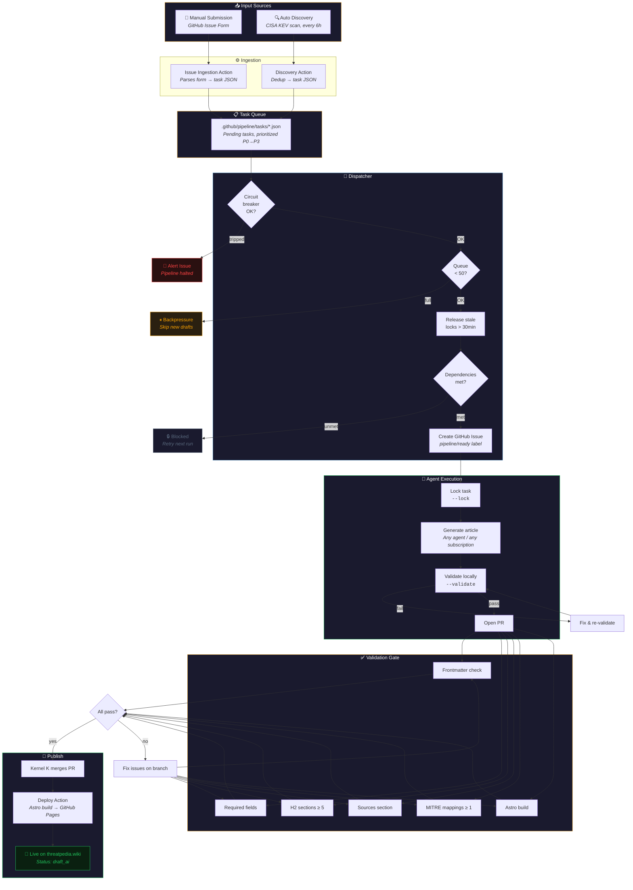
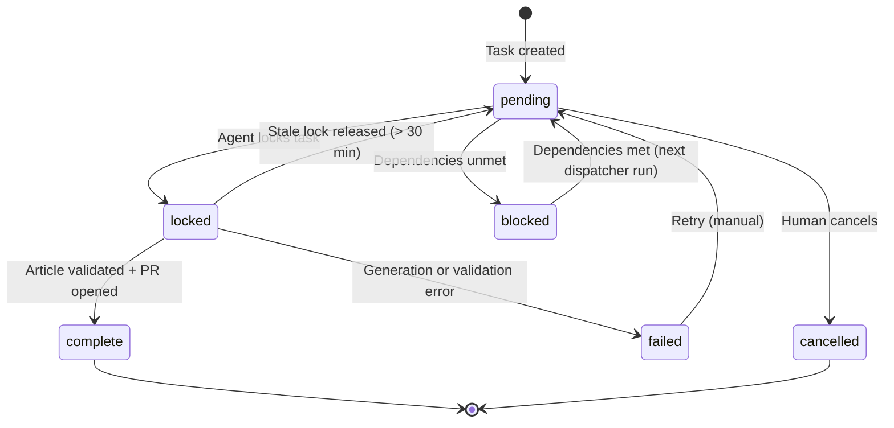
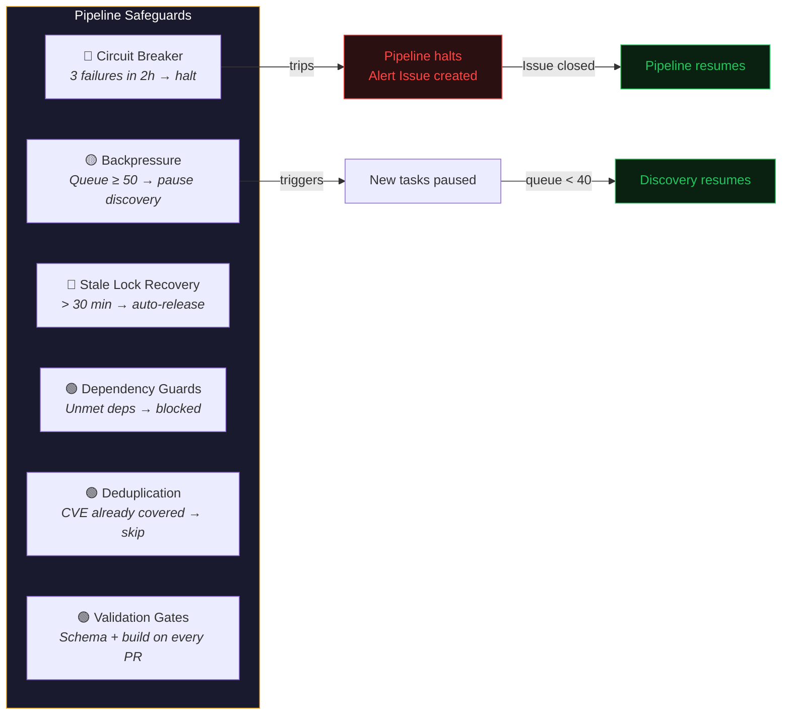
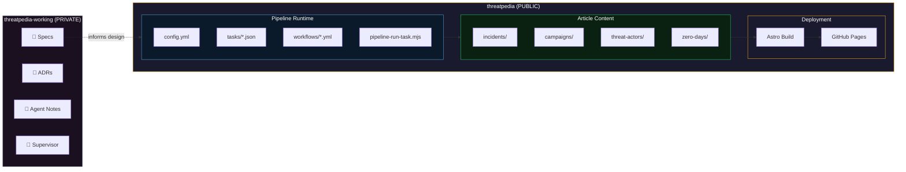

# Pipeline Flow Diagram

## Full Pipeline — End to End

```mermaid
flowchart TB
    subgraph INPUT["📥 Input Sources"]
        MS["🙋 Manual Submission<br/><i>GitHub Issue Form</i>"]
        AD["🔍 Auto Discovery<br/><i>CISA KEV scan, every 6h</i>"]
    end

    subgraph INGEST["⚙️ Ingestion"]
        II["Issue Ingestion Action<br/><i>Parses form → task JSON</i>"]
        DI["Discovery Action<br/><i>Dedup → task JSON</i>"]
    end

    subgraph QUEUE["📋 Task Queue"]
        TQ[".github/pipeline/tasks/*.json<br/><i>Pending tasks, prioritized P0→P3</i>"]
    end

    subgraph DISPATCH["🚦 Dispatcher"]
        direction TB
        CB{"Circuit<br/>breaker<br/>OK?"}
        BP{"Queue<br/>< 50?"}
        SL["Release stale<br/>locks > 30min"]
        DEP{"Dependencies<br/>met?"}
        ISS["Create GitHub Issue<br/><i>pipeline/ready label</i>"]
    end

    subgraph EXECUTE["🤖 Agent Execution"]
        LOCK["Lock task<br/><code>--lock</code>"]
        GEN["Generate article<br/><i>Any agent / any subscription</i>"]
        VAL["Validate locally<br/><code>--validate</code>"]
        PR["Open PR"]
    end

    subgraph VALIDATE["✅ Validation Gate"]
        FM["Frontmatter check"]
        FLD["Required fields"]
        H2["H2 sections ≥ 5"]
        SRC["Sources section"]
        MIT["MITRE mappings ≥ 1"]
        BLD["Astro build"]
    end

    subgraph PUBLISH["🚀 Publish"]
        MRG["Kernel K merges PR"]
        DEP2["Deploy Action<br/><i>Astro build → GitHub Pages</i>"]
        LIVE["📡 Live on threatpedia.wiki<br/><i>Status: draft_ai</i>"]
    end

    MS --> II --> TQ
    AD --> DI --> TQ

    TQ --> CB
    CB -->|"tripped"| ALERT["🚨 Alert Issue<br/><i>Pipeline halted</i>"]
    CB -->|"OK"| BP
    BP -->|"full"| PAUSE["⏸ Backpressure<br/><i>Skip new drafts</i>"]
    BP -->|"OK"| SL --> DEP
    DEP -->|"unmet"| BLOCK["🔒 Blocked<br/><i>Retry next run</i>"]
    DEP -->|"met"| ISS

    ISS --> LOCK --> GEN --> VAL
    VAL -->|"fail"| FIX["Fix & re-validate"]
    FIX --> VAL
    VAL -->|"pass"| PR

    PR --> FM & FLD & H2 & SRC & MIT & BLD
    FM & FLD & H2 & SRC & MIT & BLD --> RESULT{"All pass?"}
    RESULT -->|"yes"| MRG
    RESULT -->|"no"| FIXPR["Fix issues on branch"]
    FIXPR --> FM & FLD & H2 & SRC & MIT & BLD

    MRG --> DEP2 --> LIVE

    style INPUT fill:#1a1a2e,stroke:#e8a020,color:#fff
    style QUEUE fill:#1a1a2e,stroke:#e8a020,color:#fff
    style DISPATCH fill:#1a1a2e,stroke:#5a9fd4,color:#fff
    style EXECUTE fill:#1a1a2e,stroke:#22c55e,color:#fff
    style VALIDATE fill:#1a1a2e,stroke:#e8a020,color:#fff
    style PUBLISH fill:#1a1a2e,stroke:#22c55e,color:#fff
    style ALERT fill:#2a1010,stroke:#ff4444,color:#ff4444
    style PAUSE fill:#2a2010,stroke:#ffa500,color:#ffa500
    style BLOCK fill:#1a1a2e,stroke:#5a6a7e,color:#5a6a7e
    style LIVE fill:#0a2010,stroke:#22c55e,color:#22c55e
```

## Task State Machine

```mermaid
stateDiagram-v2
    [*] --> pending: Task created
    pending --> locked: Agent locks task
    pending --> blocked: Dependencies unmet
    blocked --> pending: Dependencies met (next dispatcher run)
    locked --> pending: Stale lock released (> 30 min)
    locked --> complete: Article validated + PR opened
    locked --> failed: Generation or validation error
    failed --> pending: Retry (manual)
    pending --> cancelled: Human cancels
    complete --> [*]
    cancelled --> [*]
```

## Failsafe Mechanisms

```mermaid
flowchart LR
    subgraph SAFEGUARDS["Pipeline Safeguards"]
        direction TB
        CB["🔴 Circuit Breaker<br/><i>3 failures in 2h → halt</i>"]
        BP["🟡 Backpressure<br/><i>Queue ≥ 50 → pause discovery</i>"]
        SL["🔵 Stale Lock Recovery<br/><i>> 30 min → auto-release</i>"]
        DG["🟢 Dependency Guards<br/><i>Unmet deps → blocked</i>"]
        DD["🟢 Deduplication<br/><i>CVE already covered → skip</i>"]
        VG["🟢 Validation Gates<br/><i>Schema + build on every PR</i>"]
    end

    CB -->|"trips"| HALT["Pipeline halts<br/>Alert Issue created"]
    HALT -->|"Issue closed"| RESUME["Pipeline resumes"]
    BP -->|"triggers"| SKIP["New tasks paused"]
    SKIP -->|"queue < 40"| RESUME2["Discovery resumes"]

    style SAFEGUARDS fill:#1a1a2e,stroke:#e8a020,color:#fff
    style HALT fill:#2a1010,stroke:#ff4444,color:#ff4444
    style RESUME fill:#0a2010,stroke:#22c55e,color:#22c55e
    style RESUME2 fill:#0a2010,stroke:#22c55e,color:#22c55e
```

## Repository Boundaries

```mermaid
flowchart LR
    subgraph PRIVATE["threatpedia-working (PRIVATE)"]
        SPECS["📄 Specs"]
        ADRS["📄 ADRs"]
        NOTES["📝 Agent Notes"]
        SUPER["👑 Supervisor"]
    end

    subgraph PUBLIC["threatpedia (PUBLIC)"]
        subgraph PIPELINE["Pipeline Runtime"]
            CONFIG["config.yml"]
            TASKS["tasks/*.json"]
            ACTIONS["workflows/*.yml"]
            RUNNER["pipeline-run-task.mjs"]
        end
        subgraph CONTENT["Article Content"]
            INC["incidents/"]
            CAMP["campaigns/"]
            TA["threat-actors/"]
            ZD["zero-days/"]
        end
        subgraph DEPLOY["Deployment"]
            BUILD["Astro Build"]
            PAGES["GitHub Pages"]
        end
    end

    SPECS -.->|"informs design"| PIPELINE
    PIPELINE --> CONTENT --> BUILD --> PAGES

    style PRIVATE fill:#1a1020,stroke:#5a6a7e,color:#fff
    style PUBLIC fill:#1a1a2e,stroke:#e8a020,color:#fff
    style PIPELINE fill:#0a1a2a,stroke:#5a9fd4,color:#fff
    style CONTENT fill:#0a2010,stroke:#22c55e,color:#fff
    style DEPLOY fill:#1a1a2e,stroke:#e8a020,color:#fff
```
